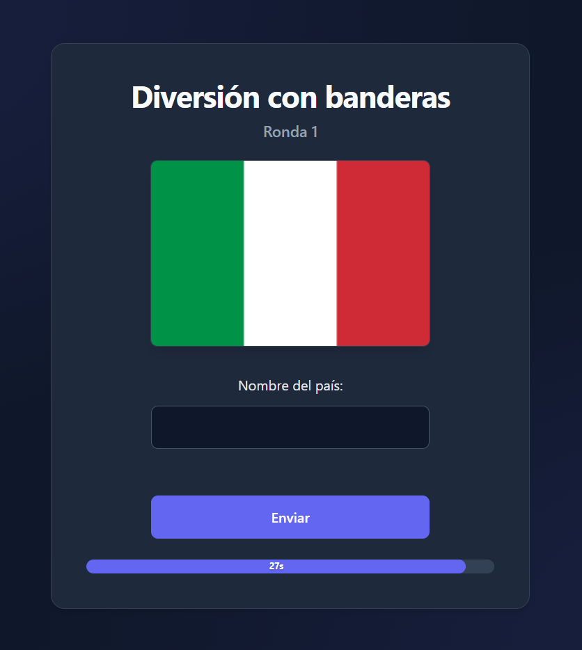
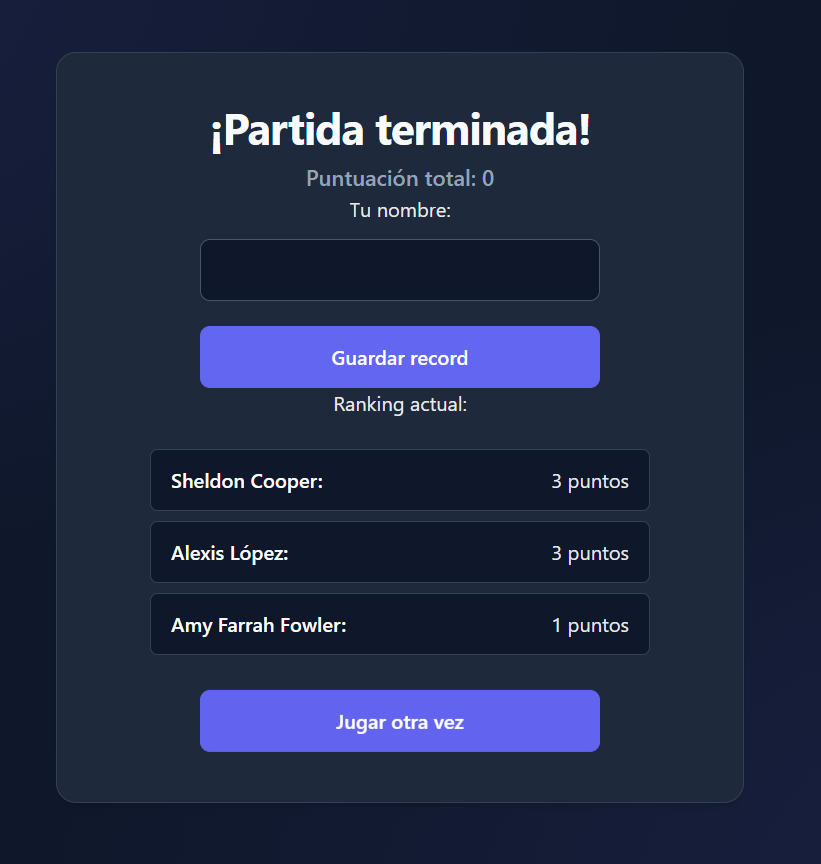

#  Diversión con Banderas - React Time Attack

[](https://react-flags-time-attack.vercel.app/)


> *"Como diría el Dr. Sheldon Cooper: Bienvenidos a Diversión con Banderas".*

Un juego de trivia geográfica contrarreloj (Time Attack) desarrollado para consolidar el aprendizaje de **React Hooks** y la gestión de estado compleja. El objetivo es migrar la lógica imperativa típica de JavaScript Vanilla a la arquitectura declarativa de React.

## 📸 Screenshots

| Gameplay (Normal) | Gameplay (Zona Crítica) | Ranking Persistente |
|:---:|:---:|:---:|
|  |  |  |

## 🎮 Características

* **Mecánica Time Attack:** Temporizador global que controla el flujo de la partida.
* **Feedback Visual Dinámico:** La barra de progreso cambia de color y estado (`CSS Modules` + `State`) cuando el tiempo entra en fase crítica (< 20%).
* **Validación de Formularios:** Implementación de **`react-hook-form`** para manejar inputs, validaciones y evitar renders innecesarios.
* **Persistencia de Datos:** Sistema de Ranking que utiliza `localStorage` para guardar las puntuaciones del usuario entre sesiones.
* **Rondas Aleatorias:** El array de países se mezcla aleatoriamente al iniciar cada partida para asegurar la rejugabilidad.

## 🛠️ Tecnologías

* **React (Vite)**
* **React Hook Form**
* **CSS3**
* **LocalStorage API**

## 🚀 Instalación y Uso

1.  Clonar el repositorio:
    ```bash
    git clone [https://github.com/AlexisLopez-Dev/react-flags-time-attack.git](https://github.com/AlexisLopez-Dev/react-flags-time-attack.git)
    ```
2.  Instalar dependencias:
    ```bash
    npm install
    ```
3.  Ejecutar en local:
    ```bash
    npm run dev
    ```

---
Hecho con ❤️ por Alexis López
